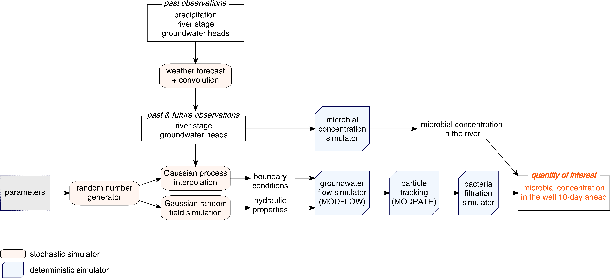
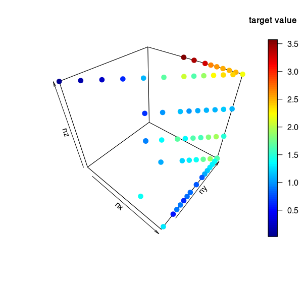
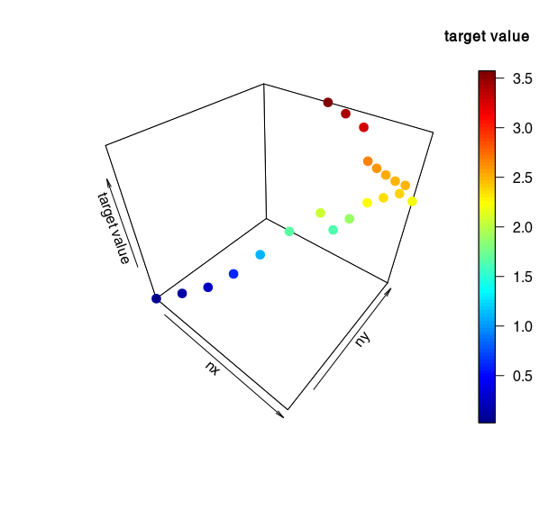

# gwModBac

Groundwater flow simulation and particle tracking to forecast microbial concentration in a drinking water extraction well.

## Installation/Run

### Requirement
- need to have "gdal_polygonize.py" installed (--> `install python-gdal`)
- need to have MODFLOW and MODPATH installed (`mfusg` for MODFLOW usgs,  `mp6` for MODPATH). If you need binaries compiled for linux (ubuntu) please contact me
- need to have [R](https://cran.r-project.org/) installed

### Run
Two possiblities:

* Open R, copy-paste `run.R` or source `run.R` (but don't forget to adapt line 15 in `run.R` the `DIR` variable to your directory structure
* Open terminal, change directory to "gwModBac" (`cd path/gwModBac`), enter 

        `Rscript --vanilla run.R sim_name 15 50 10 4 NULL 100 200 20 OK`

    * `run.R` --> path of the file `run.R`
    * `sim_name` name of the simulation (an output file `sim_name.txt` will be created in the directory `gwModBac`)
    * `15` --> nx: number of cells along the x-direction = number of columns
    * `50` --> ny: number of cells along the y-direction = number of rows
    * `10` --> nz: number of cells along the z-direction = number of layers
    * `4` --> number of runs (but one output file with all the output together)
    * `NULL` --> no seed are used. To set a seed for the random number simulator, replace `NULL` by any numeric value (e.g., `10`). With a seed, you can reproduce the simulation exactly.
    * `100` --> nx_ref: number of columns of the reference simulation (nx_ref >= nx), used to scale down the Gaussian Random Field (only used if a seed number is set)
    * `200` --> ny_ref: number of rows of the reference simulation (ny_ref >= ny), used to scale down the Gaussian Random Field (only used if a seed number is set)
    * `20` --> nz_ref: number of layers of the reference simulation (nz_ref >= nz), used to scale down the Gaussian Random Field (only used if a seed number is set)
    * `OK` [optional] --> can be anything; if the 7th argument is present, an overview plot is created for each single simulation (in the directory `simulations`): same plot as in section [Groundwater flow simulation and particle tracking](#groundwater-flow-simulation-and-particle-tracking). If absent, no plot will be created (faster).
    
    
Example with fixed seed:
    
    ```
    Rscript --vanilla run.R sim01 10 20 10 1 102343643 100 200 10 OK
    ```

Example without fixed seed and without plot:
    
    ```
    Rscript --vanilla run.R sim01 10 20 10 1 NULL 100 200 10
    ```
    
### Notes
Minimal possible grid size:

* nx >= 10
* ny >= 10
* nz >= 2

## What does "run.R" Do?
1. Read the hyperparameters/parameters from `para.R`
2. Read the data (river stage time-series, groundwater head time-series) from `data/`
3. Create the simulation grid (according to parameters)
4. Define 
   * the river properties (location, stage, riverbed), 
   * the location of the specified head boundary, 
   * the particles to estimate the microbila concentration in the drinking water extraction well.
5. Run Monte Carlo simulations (unconditional)
    1. simulate the hydraulic properties: hydraulic conductivity (Gaussian random field), porosity, etc.
    2. simulate the specified head boundary conditions (Gaussian process)
        for the 10-days ahead forecast:
        1. simulate the precipitation for the next 10 days
        2. using a convolution model between precipitation and river stage, simulate the river stage for the next 10 days
        3. using a convolution model between river stage and groundwater
			heads at the observation wells, simulate the groundwater heads 
			at the observation wells for the next 10 days
        4. Simulate the head boundary conditions conditional on the
			groundwater heads the observation wells
        5. Interpolate from the head boundary conditions the initial heads
    3. run MODFLOW
    4. run MODPATH to simulate pathway of the microbes that reach the well drinking water extraction well
    5. Simulate the microbial concentration in the river from the river stage
    6. Predict the microbial concentration in the well according to an exponential decay model that simulates the mechanical filtration of microbes in the aquifer

### Model overview


### Groundwater flow simulation and particle tracking

* contours and colour bar = hydraulic heads of the first layer
* blue square = drinking water extraction well
* coloured lines = paths of the particles entering into the well
* green dots = start positions of the particles coming from the river
* red dos = start positions of the particles that do not come from the river
* light blue multipolygon (corner at (0, 0), (0, 150), (5, 150), (5, 0) = the river


### Convergence grid scaling with fixed seed?

Some simulation results (with seed = 102343643):

* Target value as a function of nx, ny, nz:



* Target value as a function of nx, ny for nz = 10 (z-axis = target value!)



For these results, I recommand to keep nz = 10 and to only vary nx and ny (more stable, better convergence).

